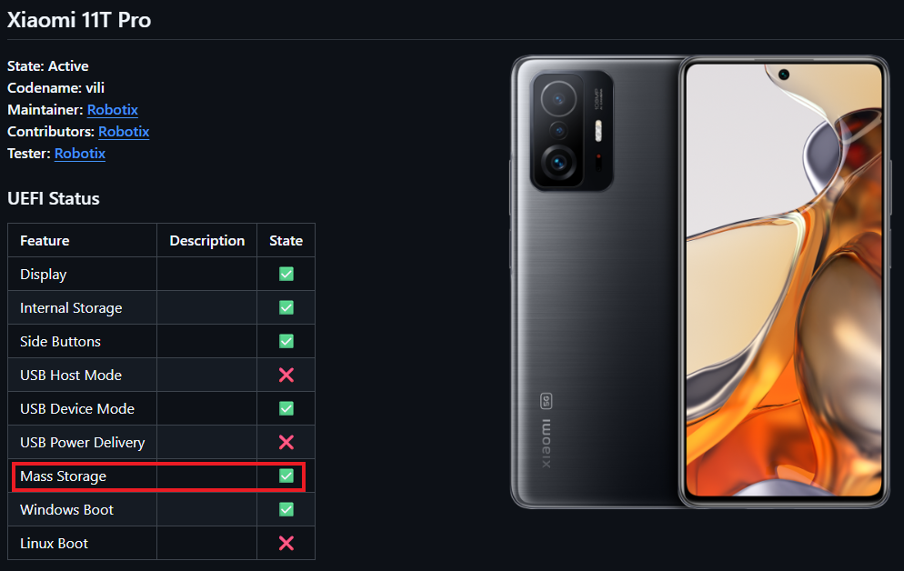
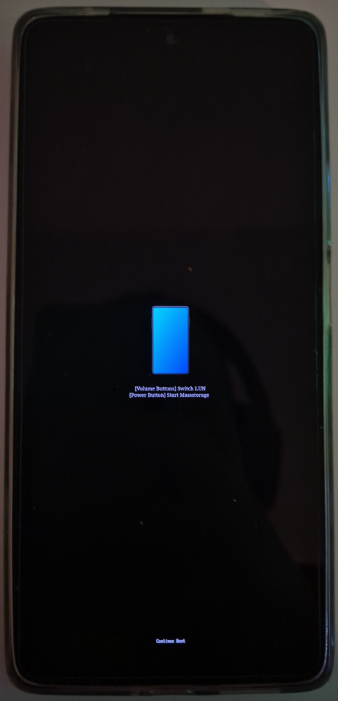
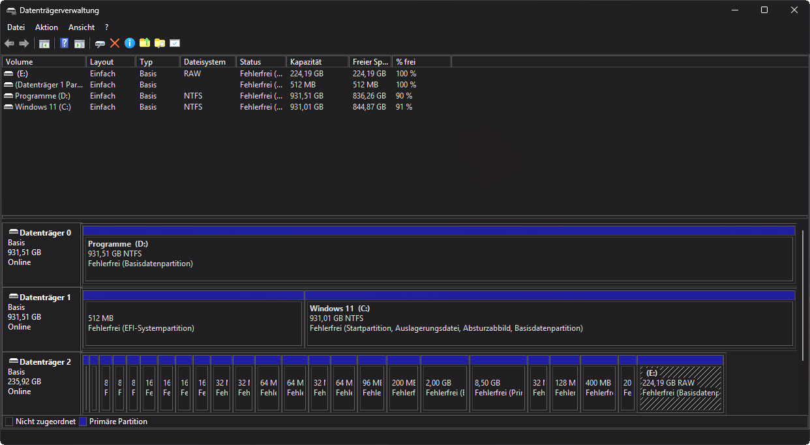
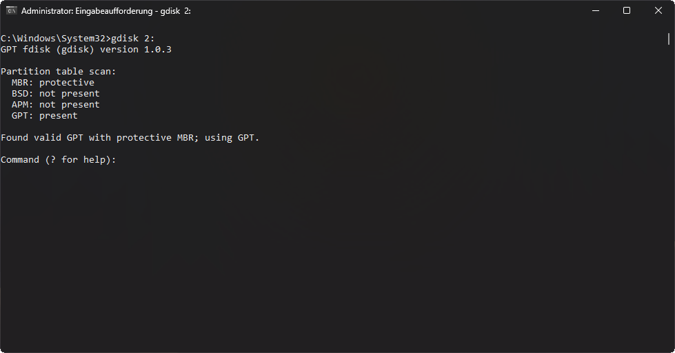

# Fixing UFS LUNs

> [!CAUTION]
> This Guide is not Recommended for Basic Users! Only for Advanced Users!

## Video Guide

> [!NOTE]
> No Video Guide here yet.

## Text Guide [Recommended]

<table>
<tr><th>Guide Sections</th></th>
<tr><td>
  
- Fixing UFS LUNs
   - [Requirements](#requirements)
   - [Preparing](#preparing)
   - [Repairing UFS LUNs](#repairing-ufs-luns)
   - [Verify Changes](#verify-changes)

</td></tr>
</table>

## Requirements

- A Windows PC
- A Device with a Snapdragon SoC and UFS Chip
- [UEFI Image](https://github.com/Project-Silicium/Mu-Silicium/releases)
- [Windows gdisk](https://sourceforge.net/projects/gptfdisk/files/gptfdisk/1.0.3/gdisk-binaries/gdisk-windows-1.0.3.zip/download)

## Preparing

Before you can Begin Fixing your UFS LUNs, You need some Files for that. <br>
Check the [UEFI Status Page](https://github.com/Project-Silicium/Mu-Silicium/blob/main/Status.md) for your Device if it Supports `Mass Storage`. <br>
If it does not Support it, Contact us on Discord for Help.



Once you Checked if your Device supports Mass Storage, Download the latest UEFI Image for your Device from [Requirements](#requirements). <br>
After that also Download the gdisk for Windows from [Requirements](#requirements). <br>
Now just Extract the .zip File and you're Ready.

## Repairing UFS LUNs

> [!CAUTION]
> This Section will Brick your Device if not Followed correctly!

To Repair the UFS LUNs you will need our UEFI Mass Storage. <br>
Flash or Boot the UEFI Image you Downloaded in [Preparing](#preparing). <br>
Once you did that, Reboot your Device and Hold Volume Down once you see the Project Silicium Logo to enter Mass Storage. <br>
If you did that Correctly, You should see a Blue Phone on your Device now:



At the Bottom of your Screen is some Text, Press the Volume Buttons until you see: `Current LUN: 0`. <br>
Once it says that, Press the Power Button to Confirm, Connect your Device now to your PC. <br>
Your PC should see a Large Disk with way to many Partitions in Disk Manager:



If you get a new Disk with one Large Unformatted Partition instead, ***Don't* Reboot your Device!**. <br>
Get the Disk Number of the new Disk, In the Picture it's `2`. <br>
Now open a Command Prompt Window as Admin in the Directory where you Extracted the gdisk .zip File. <br>
After that, Just run gdisk on the new Disk:
```cmd
: Example: ".\gdisk64.exe 2:"
: Note: Use "32" if your PC is x86
.\gdisk64.exe [Disk Number]:
```

You should now see Text like in this Pictures:




If you see the GPT Corrupted Warning in your Command Prompt like in the second Picture, then you need to Repair the GPT Table. <br>
Otherwise you can Skip this Step to repair the GPT Table.

To do that, Enter `r`, That will enter the Recovery Options. <br>
Once you did that, Enter `c` and confirm with `y`, That will repair the GPT Table. <br>
Now just Save the Changes by entering `w` and confirming with `y`. <br>
It will throw you out of gdisk, Reenter it by using the same Command as before, You should now not see the Warning anymore.

After you Fixed your GPT Table if it was Broken to Begin with, Check for other Problems by entering `v`. <br>
Only these 2 Problems matter:
```
NOTE: These are no the Entire Messages.

Problem 1: ----------------------------------------------------------------------
Using 'j' on the experts' menu can adjust this gap.
---------------------------------------------------------------------------------

Problem 2: ----------------------------------------------------------------------
Using 'k' on the experts' menu can adjust this gap.
---------------------------------------------------------------------------------
```

If you don't see any of these 2 Problems, You can skip this LUN, Enter `q` to Exit and Press Volume Up on your Device and Select the next LUN. <br>
Then follow this Section for the next LUN, If you see atleast one of these 2 Problems, You need to Fix them. <br>

If you see the Problem in the First Box, Do these Things to Fix it. <br>
First, Enter the Expert Menu by entering `x`, Then enter `j`, It will ask you for a Value, Just Press Enter there. <br>
If you see the Problem in the second Box too, Run `k` in the Expert Menu, It will also ask you for a Value, Press Enter there again. <br>
Now all Problems are Fixed.

Save the Changes by entering `w` and confirming with `y`.

## Verify Changes

Now reopen gdisk again and Check if you see Corrupted GPT Warning:


If you do, Enter `r`, then enter `c` and confirm with `y`, That Fixes the GPT Table, <br>
Now save the Changes again using `w` and confirming with `y`.

Reopen gdisk again to Check if the Corrupted GPT Warning is Gone and if the 2 Problems in `v` are Gone. <br>
If they are, Exit gdisk with `q` and Press Volume Up on your Device, Select the next LUN and Follow [Repairing UFS LUNs](#repairing-ufs-luns) Section + this Section again.

Once you're unable to Select the next LUN on your Device, that means you Reached the End, Disconnect your Device and Select `Power Off`.
